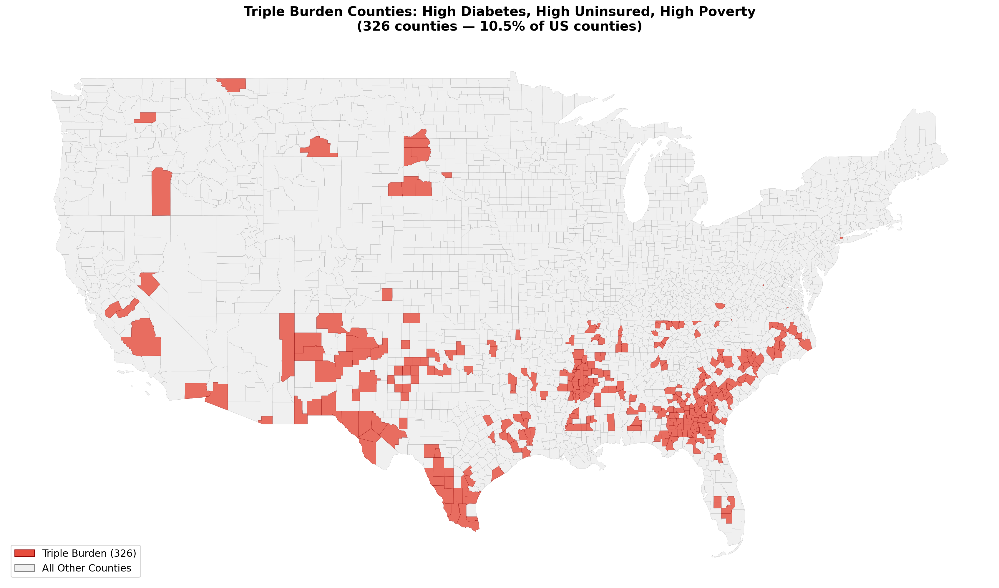
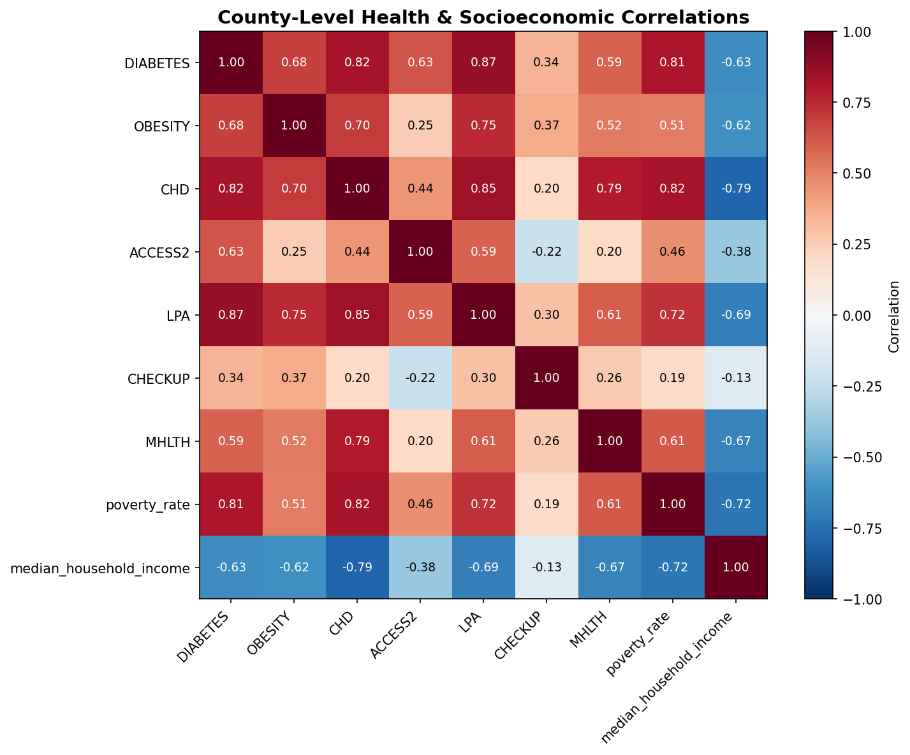

# Chronic Disease Disparities & Healthcare Access: A Geospatial Analysis

A Python ETL pipeline integrating CDC PLACES county-level health data with Census Bureau socioeconomic indicators to map the geographic intersection of chronic disease burden, healthcare access, and poverty across 2,956 U.S. counties.


*326 U.S. counties where high diabetes prevalence, high uninsured rates, and high poverty converge.*

---

## Project Overview

Chronic diseases like diabetes, obesity, and heart disease disproportionately affect communities with fewer economic resources and less access to healthcare. But where exactly do these factors overlap — and how severe are the disparities?

This project builds a reproducible data pipeline that:
- Ingests county-level health data from the **CDC PLACES** program (2,956 counties, 7 health measures)
- Integrates socioeconomic data from the **U.S. Census Bureau American Community Survey**
- Merges sources on standardized FIPS county codes
- Identifies **"triple burden" counties** — those ranking in the top 25% nationally on diabetes prevalence, uninsured rate, *and* poverty rate simultaneously
- Produces interactive and static choropleth maps for geographic exploration
- Includes a regional deep dive into **Western North Carolina** examining intra-regional urban-rural health disparities

---

## Key Findings

### Physical inactivity is the strongest county-level predictor of diabetes — not obesity.
The correlation between physical inactivity and diabetes prevalence (r = 0.87) exceeds the obesity-diabetes correlation (r = 0.68), suggesting that exercise access and behavior may matter more than weight alone at the population level.

### Heart disease tracks with poverty more tightly than any other measure.
Coronary heart disease and median household income show a -0.79 inverse correlation — the strongest socioeconomic-health relationship in the dataset. Counties with the lowest incomes consistently have the highest heart disease burden.

### 326 counties face a "triple burden" of disease, access barriers, and poverty.
These counties rank in the top quartile on diabetes prevalence, uninsured rate, and poverty rate simultaneously. They cluster heavily in the Deep South, Appalachia, and along the southern border.

### Within Western NC, health outcomes vary dramatically over short distances.
Buncombe County (Asheville) shows diabetes prevalence of 8.9% and poverty at 11.2%. Neighboring Swain County: 12.5% diabetes and 19.8% poverty — a 40% higher diabetes rate just 60 miles away. This intra-regional disparity is invisible at the state level.


*County-level correlations between health outcomes, healthcare access, and socioeconomic status.*

---

## Data Sources

| Source | Description | Geography | Records |
|--------|-------------|-----------|---------|
| [CDC PLACES](https://www.cdc.gov/places/) | Model-based health estimates from BRFSS | County (n=2,956) | 7 measures |
| [Census ACS 5-Year](https://www.census.gov/programs-surveys/acs) | Socioeconomic indicators (2022) | County | 2 measures |
| [Census TIGER/Line](https://www.census.gov/geographies/mapping-files.html) | County boundary shapefiles | County polygons | Geometries |

### Health Measures (CDC PLACES)
- **DIABETES** — Diagnosed diabetes among adults ≥18
- **OBESITY** — Obesity among adults ≥18
- **CHD** — Coronary heart disease among adults ≥18
- **ACCESS2** — No health insurance among adults 18–64
- **LPA** — No leisure-time physical activity among adults ≥18
- **CHECKUP** — Routine checkup within past year
- **MHLTH** — Poor mental health ≥14 days among adults ≥18

### Socioeconomic Measures (Census ACS)
- **Median household income**
- **Poverty rate** (% population below poverty line)

---

## Methodology

### ETL Pipeline
1. **Ingestion**: Query CDC PLACES Socrata API and Census ACS REST API for county-level records
2. **Filtering**: Isolate latest year + age-adjusted prevalence estimates to eliminate duplicate records
3. **Standardization**: Construct 5-digit FIPS codes, convert types, handle missing values
4. **Integration**: Merge health and socioeconomic data on FIPS county codes (left join)
5. **Validation**: Verify record counts, check distributions, confirm geographic coverage

### Geospatial Analysis
- County boundary shapefiles loaded via `geopandas` from Census TIGER/Line
- Data merged to geometries on FIPS codes (2,956 / 3,143 continental US counties matched — 94%)
- Choropleth maps produced with quantile classification (6 classes)
- Interactive map built with `folium` featuring hover tooltips with all measures

### Triple Burden Identification
Counties flagged where all three conditions met simultaneously:
- Diabetes prevalence ≥ 75th percentile nationally
- Uninsured rate ≥ 75th percentile nationally
- Poverty rate ≥ 75th percentile nationally

---

## Visualizations

### National Maps
| Map | Description |
|-----|-------------|
| `map_diabetes_prevalence.png` | County-level diabetes prevalence choropleth |
| `map_obesity_prevalence.png` | County-level obesity prevalence choropleth |
| `map_poverty_rate.png` | County-level poverty rate choropleth |
| `map_triple_burden.png` | Triple burden counties highlighted in red |
| `map_diabetes_interactive.html` | Interactive Folium map with hover tooltips |

### Western NC Regional Analysis
| Map | Description |
|-----|-------------|
| `wnc_comparison.png` | WNC vs NC vs National grouped bar comparison |
| `wnc_county_heatmap.png` | 18-county health profile heatmap |
| `wnc_regional_map.png` | Zoomed regional choropleth |

---

## Repository Structure

```
chronic-disease-geospatial-pipeline/
├── README.md
├── requirements.txt
├── notebooks/
│   └── analysis.ipynb              # Full narrative walkthrough
├── src/
│   ├── cdc_pipeline.py             # CDC PLACES data ingestion
│   ├── census_pipeline.py          # Census ACS data ingestion
│   ├── data_integration.py         # Multi-source merge logic
│   ├── geospatial.py               # Mapping and spatial analysis
│   └── wnc_analysis.py             # Regional deep dive
├── data/
│   └── sample_merged.csv           # Sample output (full data regenerated via pipeline)
├── figures/
│   ├── correlation_matrix.png
│   ├── diabetes_obesity_scatter.png
│   ├── map_diabetes_prevalence.png
│   ├── map_obesity_prevalence.png
│   ├── map_poverty_rate.png
│   ├── map_triple_burden.png
│   ├── wnc_comparison.png
│   ├── wnc_county_heatmap.png
│   └── wnc_regional_map.png
├── maps/
│   └── map_diabetes_interactive.html
└── .gitignore
```

---

## Tech Stack

- **Python 3.12** — Core language
- **pandas** — Data manipulation and ETL
- **geopandas** — Spatial data handling and shapefile processing
- **folium** — Interactive web map generation
- **matplotlib / seaborn** — Static visualizations
- **requests** — API integration (CDC Socrata, Census Bureau)
- **numpy** — Numerical operations

---

## How to Reproduce

```bash
# Clone the repository
git clone https://github.com/yourusername/chronic-disease-geospatial-pipeline.git
cd chronic-disease-geospatial-pipeline

# Install dependencies
pip install -r requirements.txt

# Run the full pipeline (generates all data and visualizations)
# Option 1: Jupyter notebook
jupyter notebook notebooks/analysis.ipynb

# Option 2: Run in Google Colab
# Upload analysis.ipynb to Google Colab and run all cells
```

### requirements.txt
```
pandas>=2.0
numpy>=1.24
geopandas>=0.14
folium>=0.15
mapclassify>=2.6
matplotlib>=3.7
requests>=2.31
```

No API keys required. All data sources are publicly accessible.

---

## Future Enhancements

- Add CDC PLACES census tract-level data for sub-county granularity
- Incorporate HRSA Health Professional Shortage Area designations when API access is restored
- Calculate spatial autocorrelation (Moran's I) to test statistical significance of disease clusters
- Build a Streamlit dashboard for interactive filtering by state, disease, and income bracket
- Add predictive modeling: can poverty + uninsured status predict diabetes prevalence?

---

## Author

**John Apel**
M.S. Applied Data Science — Syracuse University (December 2025)

[LinkedIn](https://www.linkedin.com/in/john-apel-76700154/) | [Portfolio](https://johnapeljr.github.io)